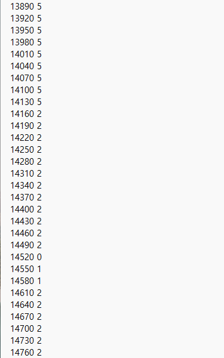
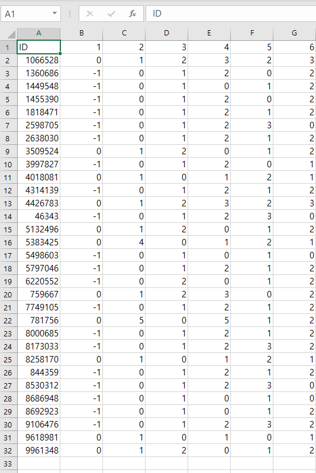

# 2025-IoT-MiniProject
## 미니 프로젝트 [프로젝트 명: ]

---

## 프로젝트 목표
1. **다양한 기술 스택 활용**: Python, MySQL, C/C++, Arduino(아두이노)를 활용하여 종합적인 시스템을 구축
    - **프로그래밍 언어**: Python, C/C++
    - **하드웨어**: Arduino 및 센서 (조도 센서, 온습도 센서 등)
    - **데이터베이스**: MySQL
    - **기타**: 데이터 시각화를 위한 라이브러리 (Pandas 등)
2. **실생활 적용 가능성**: 수면 패턴을 분석하여 보다 나은 수면 환경을 조성하는 실용적인 주제 선정

---

## 프로젝트 주제 & 선정 이유
- 이 프로젝트는 사용자의 수면 상태를 분석하며 수면 환경을 제어하는 시스템을 개발한다.  
사람이 하루동안 생활하는 데 있어 수면의 질은 매우 중요하다. 편히 자지 못하고 일어나면 그날 컨디션이 내내 좋지 않고, 푹 자고 일어나면 그날은 활기찬 하루를 보낼 수 있게 된다.  
수면의 질을 결정하는 다양한 요인 중 하나로 수면 환경이 있다. 온도, 습도, 조명 등을 제어하여 최적의 수면 환경을 조성하는 IoT 시스템을 구현하고자 이 프로젝트 주제를 선정하였다.

- **2025 IoT 과정** 중 지금까지 배운 Python, DB, C/C++을 모두 사용할 수 있는 프로젝트이다.

---

## 프로젝트 개요
1. 수면 txt 데이터를 csv로 전처리
2. MySQL DB구축 후 csv 파일 입력
3. DB에서 랜덤으로 한명 추출 후 Flask 서버를 통해 아두이노로 전송
4. 받은 데이터를 활용하여 아두이노 제어
5. 아두이노에서 측정한 데이터 Flask 서버로 전송(추후 프로젝트 활용)

---

### 데이터 수집
이 프로젝트에서는 **PhysioNet**의 **Sleep-ACCEL** 데이터셋을 활용하여 최적의 수면 환경을 위해 주변 환경 제어를 연구한다.  
이 데이터셋은 폴리솜노그래피(PSG) 기록 및 Apple Watch에서 수집된 심박수 데이터를 포함한다.

#### 수집한 데이터 종류
1. **수면 단계 데이터** ([subject-id-number]_labeled_sleep.txt)
    - PSG(Polysomnography)를 이용해 기록된 수면 단계 데이터
    - 수면 단계 분류:
        - 0: 깨어 있음 (Wake)
        - 1: N1 (얕은 수면 1단계)
        - 2: N2 (얕은 수면 2단계)
        - 3: N3 (깊은 수면)
        - 5: REM 수면

*인용: [Reference](./Reference.txt)*

---

### 데이터 전처리
1. **From txt to csv 변환**
  <!-- 여기에 관련 이미지 추가 -->
- labeled_sleep.txt
    - 시간(30초 단위) / 수면 단계

- sleep_data.csv
    - ID / 수면 단계(단계 변경 시 기록)

2. **N1, N2는 같은 단계로 취급**
    - 본 프로젝트에서는 N1과 N2 단계를 독립적으로 구분하기 보다, 이를 N3와 REM 수면 단계로 진입하는 과정으로 간주
    - 또한, N3와 REM 단계로 이동하기 위한 주변 환경 조성 방법이 유사하기에 N1에서 N2로의 이동 자체를 크게 구분할 필요가 없다고 판단

3. **추가 생성 컬럼들의 의미**
    - **D**: N3(깊은 수면) 시간
    - **R**: REM 수면 시간
    - **D+R**: N3와 REM 수면 시간의 합이 2시간을 넘는 경우 1, 그렇지 않으면 0으로 표시(N3와 REM 수면의 합이 전체 8시간 중 2시간 이상이면 충분하다고 가정)
    - **FS**: 6시간 이상 수면한 경우 1, 그렇지 않으면 0으로 표시(인간의 최소한의 수면 보장 시간을 6시간으로 설정)
    - **RT**: D+R과 FS 충족 시 남은 수면 시간

---
## Flask 서버
- 아두이노와 DB연결을 위해 Flask 서버를 활용
- 아두이노에서 측정한 데이터 출력

## 아두이노
- 기능
    - 환경 모니터링 : 온습도 측정 및 조도 센서를 통한 밝기 감지
    - LCD 디스플레이 출력 : 실시간 센서 데이터 출력
    - 부저 알람 기능 : 특정 조건 충족시 알람 울리기
    - ESP8266을 통한 WIFI 연결 : 서버와의 데이터 송수신
    - 수면 데이터 분석 : 서버에서 수면 관련 데이터 수신 및 제어
    - 아두이노와 ESP8366 시리얼 통신: 센서 데이터 및 수면 데이터 송수신

- 하드웨어 구성 <--회로 이미지 있으면 좋을 것 같댜ㅏㅏ-->
    - Arduino Uno
    - ESP8266 WIFI 모듈
    - DHT11 온습도 센서
    - 조도센서
    - LCD(I2C 방식)
    - 부저
    - LED(RGB)

- 설치 및 실행
  1. 하드웨어 연결 
     - 회로도에 맞춰 배선
     - 아두이노와 ESP8266 시리얼 통신
  2. 소프트웨어 설정
     - 아두이노 코드 업로드 (real_serial_ardu.ino)
     - ESP8266 코드 업로드하고 WIFI 정보 설정 (real_serial_esp.ino)
  3. 시스템 작동 방식
     - 시스템이 부팅되면 아두이노가 센서 데이터를 읽어서 ESP8266으로 전송
     - ESP 8266이 WIFI를 통해 서버로 데이터를 업로드
     - 서버에서 분석된 데이터를 다시 ESP8266으로 전송
     - ESP8266이 아두이노로 데이터를 전달하여 LED, LCD, 부저 등 제어
     - 특정 조건 충족 시 알람이 울리거나 메시지 표시됨

- 상황별 대응
  1. DR == 1 && FS == 1 ("wake up", 조명 서서히 밝아지게, 알람)
  2. DR == 0 && FS == 1 ("more sleep", 조명x, 알람x)
  3. DR == 1 && FS == 0 ("control Temp, RH", 자장가 ON)
  4. DR == 0 && FS == 0 ("cool Temp", 조명x, 자장가 ON)
    
- 데이터 흐름
  1. 아두이노가 센서 데이터를 측정하고 ESP8266으로 전송
  2. ESP8266이 서버로 데이터를 업로드
  3. 서버에서 수면 데이터 분석 후 ESP8266으로 결과 전송
  4. ESP8266이 데이터를 아두이노로 전달하여 LED, LCD, 부저 등을 제어

 - DB에서 받아온 데이터(D+R, FS, RT)를 보고 센서 제어

    - **상황 1**: D+R == 1 && FS == 1
        - 서서히 깨움(빛으로 조절)
        - 부저를 이용해 알람
    - **상황 2**: D+R == 0 && FS == 1
        - LED OFF
        - 부저를 이용해 편안함을 주는 소리 출력
    - **상황 3**: D+R == 1 && FS == 0
        - LED OFF
        - 아직 수면 중
    - **상황 4**: D+R == 0 && FS == 0
        - LED OFF
        - 부저를 이용해 자장가 출력

- 아두이노에서 측정한 데이터(온습도, 조도) Flask 서버로 전송

## 문제 해결
1. 수면 데이터 활용 방안 모색
2. 아두이노 조절 방법(아두이노 시뮬레이터 포트포워딩 시 보안 문제)
3. DB와 아두이노 연결 문제(직접 연결이 안되어 Flask 서버를 거쳐 전송)
4. 아두이노 wifi 연결 문제
5. ESP, 아두이노 통신 시 데이터 깨짐 문제
